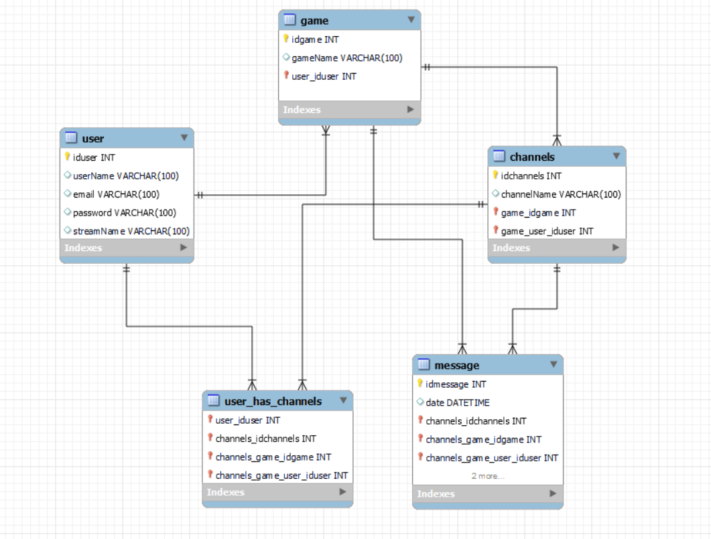

# Api Gamer Forum


# Table of Contents
- [Laravel Gamer Forum](#laravel-Gamer-Forum) ok
- [Tabla de contenido](#tabla-de-contenido) ok
- [Introducción](#Introducción) ok
- [Tech Stack 🛠](#tech-stack-) ok
- [Descripción 🛠](#Descripción-) ok
- [Tablas 🗄](#tables-) ok
- [Relaciones 🪢](#relaciones-) ok 
- [Endpoints 📋](#endpoints-) 


  - [Instalación ⚙️](#Instalación-️) 

   
 
      - [User registration](#user-registration)
      - [User profile (requires JWT)](#user-profile-requires-jwt)
      - [Games (requires JWT)](#games-requires-jwt)
      - [Parties (requires JWT)](#parties-requires-jwt)
      - [Messages (requires JWT AND Membership to party)](#messages-requires-jwt-and-membership-to-party)
  - [Special thanks 👏](#special-thanks-)


## Introduction 
Este proyecto fue impartido por GeeksHubs Academy como parte del FullStack Developer Bootcamp, que consiste en crear una API RESTful para una aplicación tipo Discord usando Laravel y JsonWebTokens.

## Tech Stack 🛠

<p align="left">
    <a href="https://laravel.com/" target="_blank" rel="noreferrer"> 
         
    </a> 
    <a href="https://www.php.net" target="_blank" rel="noreferrer"> 
         
    </a> 
    <a href="https://www.mysql.com/" target="_blank" rel="noreferrer"> 
         
    </a> 
    <a href="https://git-scm.com/" target="_blank" rel="noreferrer">
        
    </a> 
    <a href="https://heroku.com" target="_blank" rel="noreferrer"> 
         
    </a>
    <a href="https://postman.com" target="_blank" rel="noreferrer"> 
         
    </a>
    <a href="https://trello.com" target="_blank" rel="noreferrer"> 
         
    </a>
</p>

# Descripción 📋

Proyecto del bootcamp en GeeksHubs dónde desde producción nos piden que realicemos el backend de una web app dónde los usuarios pueden crear salas de los videojuegos con el fin de chatear con otros jugadores que quieran jugar, unirse a otras salas ya creadas, escribir mensajes...
Tenemos una rama `master` donde es la rama principal, de allí sacamos ramas con cada tabla para crear la usabilidad y el CRUD en cada una de ellas, como serían `users` `games` `channels` `messages` mergeando a la master una vez acabadas.

A continuación cito los objetivos MVP del proyecto:
 - Los usuarios se tienen que poder registrar a la aplicación, estableciendo un usuario/contraseña.
 - Los usuarios tienen que autenticarse a la aplicación haciendo login.
 - Los usuarios tienen que poder crear Canales (grupos) para un determinado juego.
 - Los usuarios tienen que poder buscar canales seleccionando un juego.
 - Los usuarios pueden entrar y salir de un canal.
 - Los usuarios tienen que poder enviar mensajes al canal. Estos mensajes tienen que poder ser editados y borrados por su usuario creador.
 - Los mensajes que existan en un canal se tienen que visualizar como un chat común.
 - Los usuarios pueden introducir y modificar sus datos de perfil, por ejemplo, su usuario de Steam.
 - Los usuarios tienen que poder hacer logout de la aplicación web.

# Tablas 🗄
 Así sería las relaciones entre las tablas:
 
 


Cómo podéis observar he realizado 4 entidades referenciadas como User, Game, Channel y Message, más la tabla intermedia entre User y Channel.
- Tabla `User`:  
Contiene los datos necesarios de los jugadores para registrarse en el sistema, que está relacionada con Channel y Messages.

- Tabla `Game`:
Esta tabla es muy sencilla ya que solo contiene el nombre del juego al que se realiza la búsqueda de canales.

- Tabla `Channel`:
Contiene la información sobre las salas o "Channels", que es dónde se desarrolla la parte más importante, dónde los usuarios pueden unirse o dejar el canal, escribir, editar y borrar mensajes, y visualizar los mensajes de otros usuarios que esten unidos a la misma. 

- Tabla `Messages`:
Esta tabla contiene los mensajes que crean los usuarios, contiene la clave foránea de User y de Channel, solo se pueden crear y visualizar mensajes los usuarios que estén unidos a esa party.

- Tabla intermedia `Channel_User`:
Esta es la tabla intermedia que se genera con la relacion de muchos a muchos, dentro de esta se encuentran la clave forénea de esas dos.


## Relaciones 🪢

Las relaciones entre las tablas son las siguientes:

```
- User vs Game  1:N
- Channel vs Game  1:N
- User vs Channel N:M
- User vs Message 1:N
- Channel vs Message 1:N 
```

